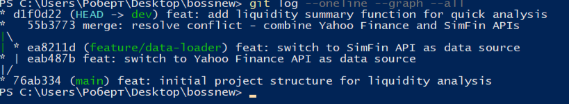

## Анализ ликвидности активов

### Информация о студенте
- **ФИО:** Варданян Роберт Барсегович
- **Группа:** БД251-м
- **Вариант:** 9

---

## Описание проекта

### Бизнес-задача
Анализ ликвидности активов предприятий для оценки их способности погашать краткосрочные обязательства. Ликвидность — ключевой показатель финансового здоровья компании.

### Проектная задача
Разработка Python-скрипта для расчета основных коэффициентов ликвидности:
- **Коэффициент текущей ликвидности (Current Ratio)** = Оборотные активы / Краткосрочные обязательства
- **Коэффициент быстрой ликвидности (Quick Ratio)** = (Оборотные активы - Запасы) / Краткосрочные обязательства
- **Коэффициент абсолютной ликвидности (Cash Ratio)** = Денежные средства / Краткосрочные обязательства

### Техническое задание (Git)
Демонстрация команды `git cherry-pick` для переноса коммита из ветки `dev` в `main`.

---

## Структура проекта

```
CDAP/
├── data/                    # Сырые данные (не включены в Git)
├── notebooks/               # Jupyter notebooks для анализа
├── src/                     # Исходный код
│   ├── __init__.py
│   ├── loader.py            # Загрузка данных
│   └── liquidity.py         # Расчет коэффициентов ликвидности
├── docs/                    # Документация и скриншоты
├── .gitignore               # Исключения для Git
├── requirements.txt         # Зависимости Python
└── README.md                # Описание проекта
```

---

## Источник данных

**Dataset:** Financial Statements of Major Companies (Kaggle)  
**URL:** https://www.kaggle.com/datasets/rish59/financial-statements-of-major-companies

Данные содержат балансовые отчёты компаний с информацией об активах и обязательствах, необходимой для расчёта коэффициентов ликвидности.

---

## Установка и запуск

```bash
# Клонирование репозитория
git clone https://github.com/vardanyan4ik/DEP-MGPU.git
cd DEP-MGPU
git checkout lab1-main

# Установка зависимостей
pip install -r requirements.txt

# Запуск расчета ликвидности
python src/liquidity.py
```

---

## Демонстрация Git (Лабораторная работа №1)

### Стратегия ветвления

| Ветка | Описание |
|-------|----------|
| `lab1-main` | Основная стабильная ветка |
| `lab1-dev` | Ветка разработки |
| `lab1-feature-data-loader` | Разработка загрузчика данных |

### Выполненные операции Git

1. **Инициализация репозитория** — создание структуры проекта
2. **Создание веток** — `main` → `dev` → `feature/data-loader`
3. **Симуляция конфликта** — параллельные изменения в `loader.py`
4. **Разрешение конфликта** — объединение двух источников данных
5. **Cherry-pick** — перенос коммита из `dev` в `main`
6. **Слияние** — интеграция `dev` в `main`

---

## Демонстрация Cherry-Pick (Вариант 9)

### Что такое Cherry-Pick?

`git cherry-pick` позволяет перенести **один конкретный коммит** из одной ветки в другую, не выполняя полное слияние.

### Сценарий использования

```bash
# 1. Находимся в main
git checkout main

# 2. Находим хеш нужного коммита из dev
git log dev --oneline
# Видим: d1f0d22 feat: add liquidity summary function for quick analysis

# 3. Переносим конкретный коммит
git cherry-pick d1f0d22

# 4. Результат: коммит появился в main с новым хешем
git log --oneline
# Видим: 629ab45 feat: add liquidity summary function for quick analysis
```

### Результат Cherry-Pick

После выполнения `cherry-pick`:
- В `main` появился коммит `629ab45`
- В `dev` остался оригинальный коммит `d1f0d22`
- Оба коммита имеют одинаковое содержание, но разные хеши

---

## Скриншоты выполнения

### 1. Конфликт при слиянии


*Git обнаружил конфликт в файле `src/loader.py` — обе ветки изменили одну строку*

### 2. История коммитов (до cherry-pick)


*Видна структура веток: main, dev, feature/data-loader и точки слияния*

### 3. Результат Cherry-Pick


*Коммит `629ab45` в main и `d1f0d22` в dev — один и тот же коммит с разными хешами*

### 4. Финальная история


*Полная история: начальный коммит → cherry-pick → слияние dev в main*

---

## Разрешение конфликта

При слиянии `feature/data-loader` в `dev` возник конфликт:

```
<<<<<<< HEAD
# URL источника данных (Yahoo Finance API)
DATA_SOURCE_URL = "https://query1.finance.yahoo.com/v8/finance"
=======
# URL источника данных (SimFin Financial Data)
DATA_SOURCE_URL = "https://simfin.com/data/access/api"
>>>>>>> feature/data-loader
```

**Решение:** объединены оба источника (основной + резервный):

```python
# URL источника данных (Yahoo Finance API - primary, SimFin - backup)
DATA_SOURCE_URL = "https://query1.finance.yahoo.com/v8/finance"
DATA_SOURCE_URL_BACKUP = "https://simfin.com/data/access/api"
```

---

## Лицензия

Учебный проект. МИРЭА, 2026.
