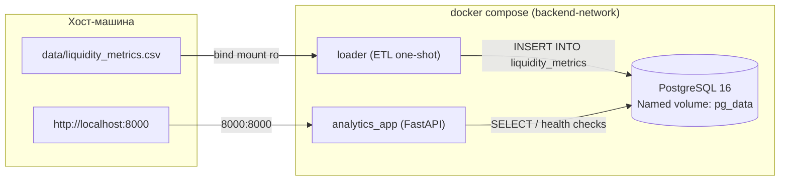
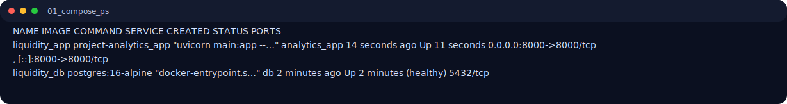
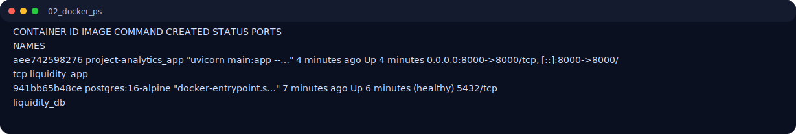
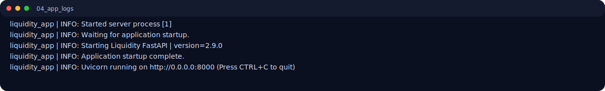
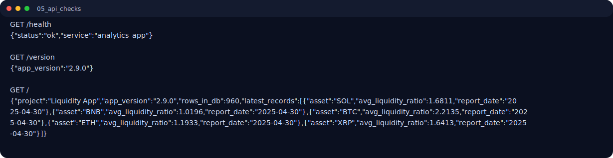
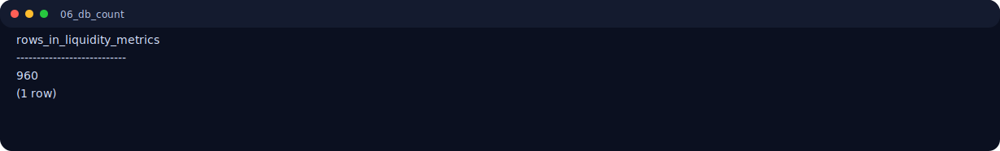
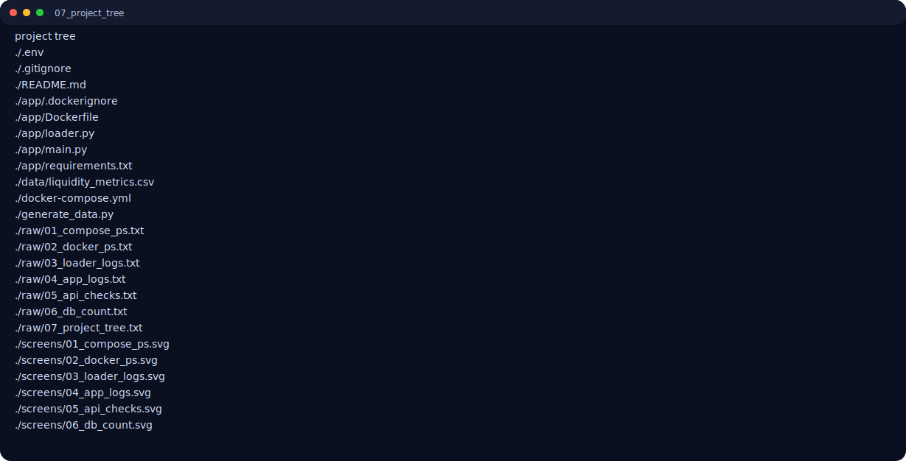

# Лабораторная работа №2. Упаковка многокомпонентного аналитического приложения с помощью Docker и Docker Compose

**Вариант 9** — Финансы / Ликвидность / FastAPI-сервис  
**Техническое задание** — использовать `ARG` в Dockerfile для передачи версии приложения при сборке и выводить эту версию при старте.

---

## 1. Архитектура решения



Сервисы:
- `db` — PostgreSQL для хранения метрик ликвидности.
- `loader` — init/ephemeral ETL-контейнер: загружает CSV в БД и завершает работу.
- `analytics_app` — FastAPI сервис, читает данные из БД и отдает API (`/`, `/health`, `/version`).

---

## 2. Технологический стек

- Python `3.10-slim`
- FastAPI + Uvicorn
- PostgreSQL 16 (alpine)
- Docker + Docker Compose V2

---

## 3. Структура проекта

```text
lab_02_variant_09/
├── lw_02_09.md
├── docker-compose.yml
├── .env
├── .gitignore
├── generate_data.py
├── data/
│   └── liquidity_metrics.csv
├── raw/
│   ├── 01_compose_ps.txt
│   ├── 02_docker_ps.txt
│   ├── 03_loader_logs.txt
│   ├── 04_app_logs.txt
│   ├── 05_api_checks.txt
│   └── 06_db_count.txt
├── screens/
│   ├── 01_compose_ps.svg
│   ├── 02_docker_ps.svg
│   ├── 03_loader_logs.svg
│   ├── 04_app_logs.svg
│   ├── 05_api_checks.svg
│   └── 06_db_count.svg
└── app/
    ├── Dockerfile
    ├── .dockerignore
    ├── requirements.txt
    ├── loader.py
    └── main.py
```

---

## 4. Dockerfile и best practices

В `app/Dockerfile` реализованы требования:

1. Фиксированный базовый образ: `python:3.10-slim`.
2. Непривилегированный пользователь: `appuser`, `UID 1000`.
3. Оптимизация слоев: сначала `COPY requirements.txt` + `pip install`, затем код.
4. Очистка кэша apt: `rm -rf /var/lib/apt/lists/*`.
5. `.dockerignore` исключает локальный мусор (`.venv`, `.git`, `__pycache__`, `.env`, `*.csv`).

### Реализация технического задания варианта 9

В Dockerfile:

```dockerfile
ARG APP_VERSION=0.1.0
ENV APP_VERSION=${APP_VERSION}
```

В `docker-compose.yml` версия передается как build-arg:

```yaml
build:
  context: ./app
  args:
    APP_VERSION: ${APP_VERSION}
```

В `main.py` версия выводится при старте:

```python
logger.info("Starting Liquidity FastAPI | version=%s", APP_VERSION)
```

И доступна через endpoint `/version`.

---

## 5. Оркестрация Docker Compose

Ключевые настройки `docker-compose.yml`:

- `depends_on` + `condition: service_healthy` для `db`.
- `loader` запускается после healthy БД.
- `analytics_app` запускается после healthy БД и успешного завершения loader (`service_completed_successfully`).
- named volume `pg_data` для хранения БД.
- bind mount `./data:/data:ro` для loader.
- единая сеть `backend-network`.
- переменные в `.env`, без хардкода паролей в compose.

---

## 6. Запуск

```bash
python3 generate_data.py
docker compose up -d --build
```

Проверка API:

```bash
curl http://localhost:8000/health
curl http://localhost:8000/version
curl http://localhost:8000/
```

Остановка:

```bash
docker compose down
```

---

## 7. Результаты и скриншоты

### 7.1 Статус сервисов Compose



### 7.2 Запущенные контейнеры Docker



### 7.3 Логи loader (успешная загрузка ETL)


### 7.4 Логи analytics_app (включая вывод версии)



### 7.5 Ответы API (`/health`, `/version`, `/`)



### 7.6 SQL-проверка количества загруженных строк



### 7.7 Структура подготовленного проекта (для репозитория)



---

## 8. Проверка требований

| # | Требование | Статус |
|---|------------|--------|
| 1 | Оптимизированный Dockerfile + fixed image + non-root UID1000 | ✅ |
| 2 | Compose на 3 сервиса (db + loader + analytics_app) | ✅ |
| 3 | `depends_on` с `service_healthy` | ✅ |
| 4 | Healthcheck у БД | ✅ |
| 5 | Named volume для БД | ✅ |
| 6 | Bind mount для loader (read-only) | ✅ |
| 7 | Одна изолированная сеть `backend-network` | ✅ |
| 8 | Переменные и пароль в `.env` без хардкода | ✅ |
| 9 | Вариант 9: Build ARG `APP_VERSION` + вывод версии при старте | ✅ |
| 10 | Скриншоты и структура проекта в отчете | ✅ |

---

## 9. Вывод

Собран переносимый микросервисный продукт для аналитической задачи «Ликвидность»: база данных, ETL-init контейнер и FastAPI-приложение. Реализованы лучшие практики Dockerfile, безопасная конфигурация через `.env`, персистентность данных через named volume и оркестрация зависимостей через `healthcheck` + `depends_on`. Специфическое требование варианта 9 выполнено: версия передается через `ARG` при сборке и отображается при старте/в API.
