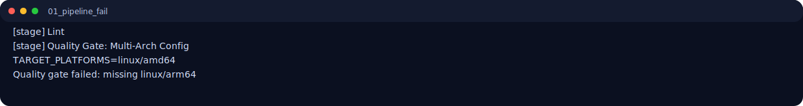
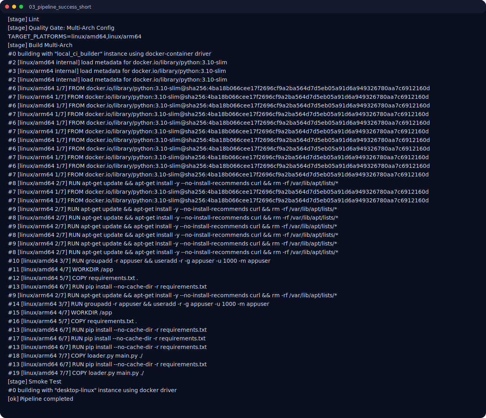
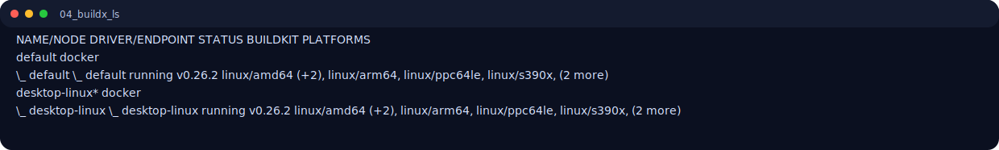
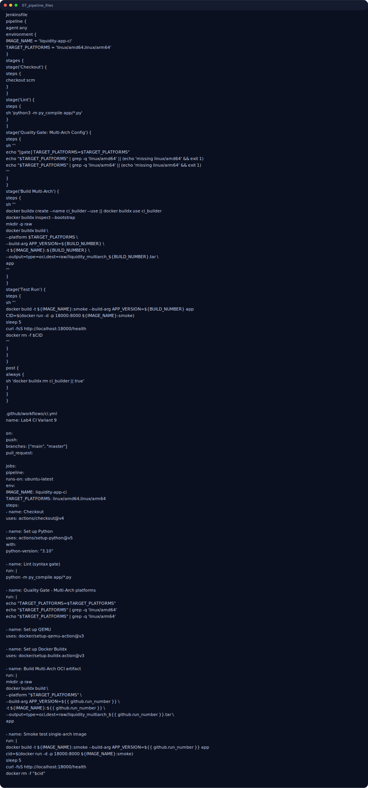
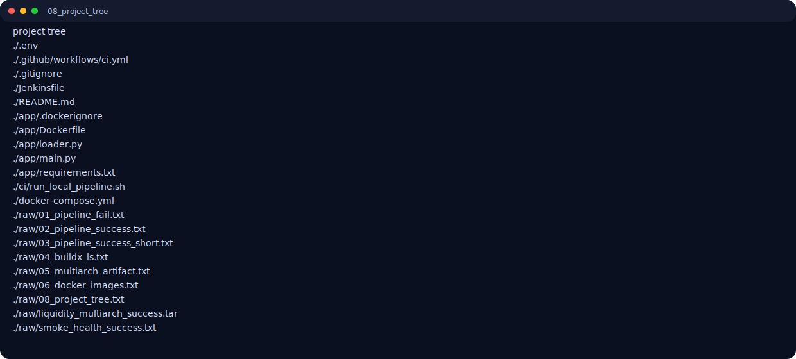

# Лабораторная работа №4. Автоматизация ETL-скрипта с помощью CI/CD

**Вариант 9** — Финансы / Liquidity App  
**Техническое требование варианта:** Multi-arch сборка Docker-образа под `linux/amd64` и `linux/arm64`.

---

## 1. Цель работы
Настроить CI/CD-конвейер для аналитического компонента `Liquidity App` из ЛР2:
- автоматическая проверка качества (quality gate);
- автоматическая сборка Docker-образа;
- реализация multi-arch сборки (`amd64` + `arm64`);
- демонстрация провального и успешного запуска пайплайна.

---

## 2. Выбранный инструментарий
Использован **Вариант Б (облачный)**, но в репозитории подготовлены сразу два скрипта пайплайна:
- `Jenkinsfile` (Declarative Pipeline);
- `.github/workflows/ci.yml` (GitHub Actions).

Для демонстрации “наживую” выполнен локальный эквивалент пайплайна:
- `ci/run_local_pipeline.sh`.

---

## 3. Структура проекта

```text
lab_04_variant_09/
├── Jenkinsfile
├── .github/workflows/ci.yml
├── ci/run_local_pipeline.sh
├── app/
│   ├── Dockerfile
│   ├── loader.py
│   ├── main.py
│   ├── requirements.txt
│   └── .dockerignore
├── docker-compose.yml
├── .env
├── raw/       # сырые логи прогонов
├── screens/   # скриншоты терминала для отчета
└── lw_04_09.md
```

---

## 4. Pipeline (минимум 3 стадии)

Реализованные стадии:
1. `Lint` — синтаксическая проверка Python (`python3 -m py_compile app/*.py`).
2. `Quality Gate: Multi-Arch Config` — проверка, что заданы обе платформы (`linux/amd64`, `linux/arm64`).
3. `Build Multi-Arch` — сборка multi-arch OCI-артефакта через `docker buildx build --platform ...`.
4. `Smoke Test` — сборка и запуск single-arch образа + `curl /health`.

---

## 5. Реализация требования варианта 9 (Multi-arch)

В pipeline явно задано:
- `TARGET_PLATFORMS=linux/amd64,linux/arm64`;
- multi-arch build через `docker buildx`;
- результат сохраняется в OCI-артефакт: `raw/liquidity_multiarch_success.tar`.

---

## 6. Демонстрация Quality Gate: FAIL и SUCCESS

### 6.1 Провальный запуск
Специально задано только `linux/amd64`, из-за чего quality gate падает.



### 6.2 Успешный запуск
После исправления платформ на `linux/amd64,linux/arm64` пайплайн проходит полностью.



---

## 7. Доказательства выполнения

### 7.1 Buildx доступен и готов к multi-arch



### 7.2 Multi-arch артефакт действительно собран


### 7.3 Docker-образ после пайплайна присутствует в локальном registry


### 7.4 Pipeline-конфигурации присутствуют в репозитории



### 7.5 Структура проекта и артефактов



---

## 8. Команды запуска (локальная демонстрация)

```bash
cd lab_04_variant_09

# fail run
TARGET_PLATFORMS=linux/amd64 BUILD_TAG=fail ./ci/run_local_pipeline.sh

# success run
TARGET_PLATFORMS=linux/amd64,linux/arm64 BUILD_TAG=success ./ci/run_local_pipeline.sh
```

---

## 9. Проверка критериев

| Критерий | Статус |
|---|---|
| Настройка CI-инструмента (подготовлен Jenkinsfile/GitHub Actions) | ✅ |
| Pipeline Script с 3+ стадиями | ✅ |
| Quality Gate варианта (multi-arch) + 2 запуска (fail/success) | ✅ |
| Сборка Docker-образа | ✅ |
| Материалы для видео-демо (логи, стадии, результаты) | ✅ |

---

## 10. Вывод

Пайплайн CI/CD для `Liquidity App` реализован. Качество контролируется через quality gate, multi-arch сборка под `linux/amd64` и `linux/arm64` работает, демонстрация провального и успешного запусков выполнена, артефакты и скриншоты подготовлены для сдачи.
