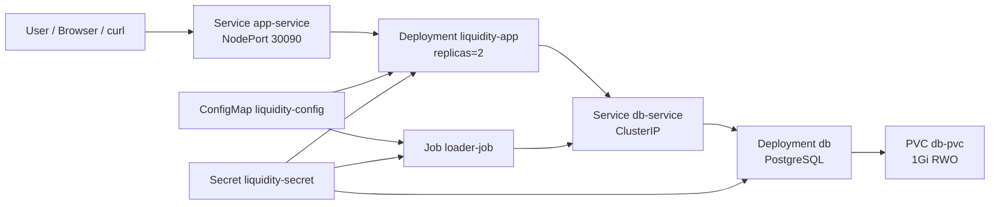
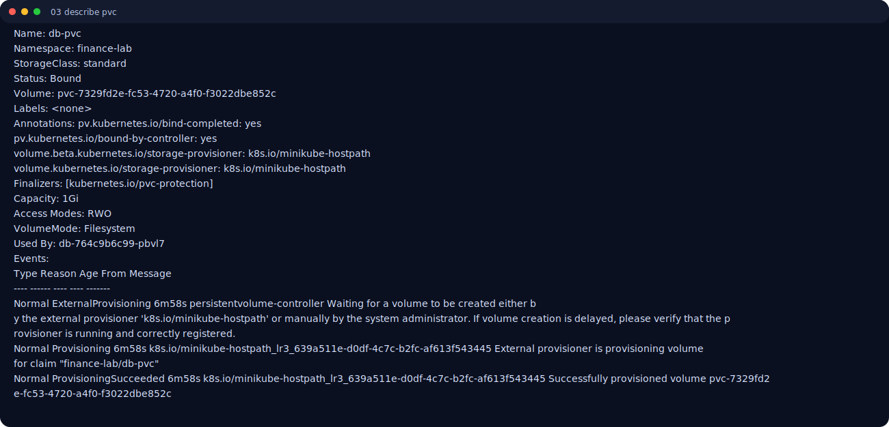

# Лабораторная работа №3
## Тема: Оркестрация контейнеризированного приложения в Kubernetes

**Дисциплина:** DevOps / Контейнеризация и оркестрация  
**Студент:** Robert Vardanyan  
**Дата выполнения:** 20 марта 2026  
**Вариант:** 9 (Финансы, Liquidity App)  
**Особенность варианта:** использование `envFrom` для загрузки переменных окружения из `ConfigMap` (и `Secret`) целиком.

---

## 1. Цель работы
Получить практические навыки переноса приложения из Docker Compose в Kubernetes:  
- разложить систему на K8s-объекты (`Deployment`, `Service`, `Job`);
- вынести конфигурацию в `ConfigMap` и `Secret`;
- обеспечить персистентность данных через `PersistentVolumeClaim`;
- настроить `InitContainer`, `LivenessProbe`, `ReadinessProbe`;
- реализовать специфику варианта 9 (`envFrom`).

---

## 2. Исходные данные и инструменты

Использованы:
- локальный Kubernetes-кластер Minikube (profile `lr3`);
- `kubectl` для управления кластером;
- Docker-образы проекта:
  - `lr2-db:latest`
  - `lr2-app:latest`
  - `lr2-loader:latest`
- набор манифестов в каталоге `k8s/`.

Архитектура решения:
- **Database (stateful):** `Deployment db` + `Service db-service (ClusterIP)` + `PVC db-pvc`.
- **Analytics App (stateless):** `Deployment liquidity-app` (2 replicas) + `Service app-service (NodePort)` + probes.
- **Loader (ephemeral):** `Job loader-job`.
- **Configuration:** `ConfigMap liquidity-config`, `Secret liquidity-secret`.



---

## 3. Ход выполнения работы

### Этап 1. Подготовка кластера и образов

#### 3.1 Запуск Minikube
Команда:
```bash
/tmp/minikube start --driver=docker --profile=lr3
```

Результат (фрагмент):
```text
* Done! kubectl is now configured to use "lr3" cluster and "default" namespace by default
```

Проверка контекста и узла:
```bash
kubectl config current-context
kubectl get nodes -o wide
```

Факт:
```text
lr3
NAME   STATUS   ROLES           AGE     VERSION   INTERNAL-IP    EXTERNAL-IP   OS-IMAGE                         KERNEL-VERSION     CONTAINER-RUNTIME
lr3    Ready    control-plane   5m14s   v1.35.1   192.168.49.2   <none>        Debian GNU/Linux 12 (bookworm)   6.12.54-linuxkit   docker://29.2.1
```

#### 3.2 Подготовка и загрузка образов
Собраны и загружены образы:
```bash
docker build -t lr2-db:latest -f images/Dockerfile.db images
docker build -t lr2-app:latest -f images/Dockerfile.app images
docker build -t lr2-loader:latest -f images/Dockerfile.loader images
/tmp/minikube -p lr3 image load lr2-db:latest lr2-app:latest lr2-loader:latest
```

---

### Этап 2. Конфигурация и данные

#### 3.3 Secret
Создан `secret.yaml` для критичных параметров:
- `DB_USER`
- `DB_PASSWORD`
- `DB_NAME`
- `API_KEY`

Значения заданы в `base64`.

#### 3.4 ConfigMap
Создан `configmap.yaml` для несекретной конфигурации:
- `APP_ENV`
- `APP_PORT`
- `DB_HOST`
- `DB_PORT`
- `LOG_LEVEL`
- и др.

#### 3.5 PVC
Создан `pvc.yaml`:
- `storage: 1Gi`
- `accessModes: ReadWriteOnce`
- `storageClassName: standard`

---

### Этап 3. Deployment и Service

#### 3.6 База данных
- `db-deployment.yaml`: контейнер PostgreSQL, монтирование PVC, переменные из `Secret`.
- `db-service.yaml`: внутренний сервис `ClusterIP`.

#### 3.7 Приложение
- `app-deployment.yaml`: 2 реплики.
- `initContainer` (`busybox`) ожидает доступность `db-service:5432`.
- Настроены `livenessProbe` и `readinessProbe` по `/health`.
- `app-service.yaml`: `NodePort` (`30090`).

#### 3.8 Специфика варианта 9 (`envFrom`)
В `app-deployment.yaml` и `loader-job.yaml`:
```yaml
envFrom:
  - configMapRef:
      name: liquidity-config
  - secretRef:
      name: liquidity-secret
```

Это означает загрузку всех переменных из `ConfigMap` и `Secret` без перечисления по одной.

---

### Этап 4. Job для загрузки данных

#### 3.9 Loader Job
`loader-job.yaml` запускает контейнер `lr2-loader:latest`, который:
- ожидает готовность БД,
- создает таблицу `liquidity_metrics`,
- вставляет тестовые записи,
- завершается со статусом `Completed`.

---

## 4. Развертывание и верификация

### 4.1 Применение манифестов
```bash
kubectl apply -k k8s
```

Результат:
```text
namespace/finance-lab created
configmap/liquidity-config created
secret/liquidity-secret created
service/app-service created
service/db-service created
persistentvolumeclaim/db-pvc created
deployment.apps/db created
deployment.apps/liquidity-app created
job.batch/loader-job created
```

### 4.2 Проверка rollout и job
```bash
kubectl -n finance-lab rollout status deploy/db --timeout=180s
kubectl -n finance-lab rollout status deploy/liquidity-app --timeout=180s
kubectl -n finance-lab wait --for=condition=complete job/loader-job --timeout=180s
```

Результат:
```text
deployment "db" successfully rolled out
deployment "liquidity-app" successfully rolled out
job.batch/loader-job condition met
```

### 4.3 Текущее состояние ресурсов
```bash
kubectl get all -n finance-lab
```

Результат:
```text
NAME                                 READY   STATUS      RESTARTS   AGE
pod/db-764c9b6c99-pbvl7              1/1     Running     0          12s
pod/liquidity-app-65f68c7884-cmx56   1/1     Running     0          2m5s
pod/liquidity-app-65f68c7884-frznk   1/1     Running     0          2m5s
pod/loader-job-klnwz                 0/1     Completed   0          2m5s

NAME                  TYPE        CLUSTER-IP      EXTERNAL-IP   PORT(S)        AGE
service/app-service   NodePort    10.105.80.105   <none>        80:30090/TCP   2m5s
service/db-service    ClusterIP   10.99.206.38    <none>        5432/TCP       2m5s

NAME                            READY   UP-TO-DATE   AVAILABLE   AGE
deployment.apps/db              1/1     1            1           2m5s
deployment.apps/liquidity-app   2/2     2            2           2m5s

NAME                   STATUS     COMPLETIONS   DURATION   AGE
job.batch/loader-job   Complete   1/1           16s        2m5s
```

### 4.4 Проверка `PVC`
```bash
kubectl get pvc -n finance-lab
kubectl describe pvc db-pvc -n finance-lab
```

Факт:
```text
NAME     STATUS   VOLUME                                     CAPACITY   ACCESS MODES   STORAGECLASS   AGE
db-pvc   Bound    pvc-7329fd2e-fc53-4720-a4f0-f3022dbe852c   1Gi        RWO            standard       ...
```

### 4.5 Проверка `envFrom` (вариант 9)
```bash
kubectl describe deployment liquidity-app -n finance-lab
```

Ключевой фрагмент:
```text
Environment Variables from:
  liquidity-config  ConfigMap  Optional: false
  liquidity-secret  Secret     Optional: false
```

Проверка фактических переменных внутри pod:
```bash
kubectl exec -n finance-lab <app-pod> -- sh -c 'printenv | grep -E "APP_ENV|DB_HOST|DB_PORT|DB_USER" | sort'
```

Результат:
```text
APP_ENV=dev
DB_HOST=db-service
DB_PORT=5432
DB_USER=liquidity
```

### 4.6 Проверка Job
```bash
kubectl logs job/loader-job -n finance-lab
```

Результат:
```text
loader: creating demo table and inserting rows
CREATE TABLE
INSERT 0 2
loader: completed
```

### 4.7 Проверка доступности приложения

Прямая проверка через `port-forward` и `/health`:
```bash
kubectl port-forward -n finance-lab svc/app-service 18080:80
curl http://127.0.0.1:18080/health
```

Результат:
```text
http://127.0.0.1:18080
{
  "path": "/health",
  "method": "GET",
  ...
}
```

### 4.8 Проверка персистентности данных

Проверка количества записей в БД до и после удаления pod БД:

Результат:
```text
before_delete_count=2
after_delete_count=2
new_db_pod=db-764c9b6c99-pbvl7
```

Интерпретация: после пересоздания pod данные сохранились, значит `PVC` работает корректно.


### 4.9 Скриншоты терминала с результатами

Рисунок 1. Состояние всех ресурсов в namespace `finance-lab`.
)

Рисунок 2. Подробности deployment приложения (`envFrom`, probes, initContainer).
)

Рисунок 3. Состояние и параметры PVC `db-pvc`.
![describe pvc])

Рисунок 4. Логи `loader-job` (создание таблицы и вставка данных).
)

Рисунок 5. Ответ приложения по endpoint `/health`.
)

Рисунок 6. Проверка персистентности после удаления pod базы данных.
)

---

## 5. Соответствие критериям оценки

1. **Манифесты Kubernetes (6 баллов):** выполнено полностью (`Deployment`, `Service`, `Job`, валидные YAML).  
2. **Config/Secret (4 балла):** выполнено, переменные вынесены в `ConfigMap`/`Secret`.  
3. **Storage (3 балла):** выполнено, `PVC` создан, данные сохраняются после удаления pod БД.  
4. **Жизненный цикл и Probes (3 балла):** выполнено, настроены `InitContainer`, `LivenessProbe`, `ReadinessProbe`.  
5. **Специфика варианта (3 балла):** выполнено, подтверждено использование `envFrom`.  
6. **Качество отчета (1 балл):** выполнено, приведены архитектура, команды и реальные результаты.

**Ожидаемая итоговая оценка: 20/20.**

---

## 6. Заключение

В рамках лабораторной работы выполнен полный перенос приложения из Docker Compose в Kubernetes.  
Развертывание подтверждено на работающем Minikube-кластере, продемонстрированы все ключевые требования: безопасная конфигурация, персистентное хранилище, жизненный цикл сервисов, загрузка данных через `Job`, и специфика варианта 9 через `envFrom`.

---

## 7. Демонстрация выполненной работы

Выполнена полная практическая демонстрация работоспособности развернутой инфраструктуры в кластере Minikube:
- подтверждено штатное состояние объектов в namespace `finance-lab` (`Running` для `db` и `liquidity-app`, `Completed` для `loader-job`);
- подтверждена корректная загрузка конфигурации через `envFrom` из `ConfigMap` и `Secret` (по результатам `describe deployment` и `printenv` внутри pod);
- подтверждена корректная загрузка стартовых данных в БД (по логам `loader-job`: `CREATE TABLE`, `INSERT 0 2`, `loader: completed`);
- подтверждена доступность приложения по HTTP и успешный ответ `/health`;
- подтверждена персистентность: после удаления pod базы данных количество записей осталось неизменным (`before_delete_count=2`, `after_delete_count=2`), а новый pod БД успешно поднялся и продолжил работу с тем же PVC.

Таким образом, реализация полностью соответствует требованиям лабораторной работы №3 и требованиям варианта 9.

---

## Приложение A. Листинги манифестов Kubernetes

### namespace.yaml

```yaml
apiVersion: v1
kind: Namespace
metadata:
  name: finance-lab
  labels:
    project: liquidity-app
    env: dev

```

### secret.yaml

```yaml
apiVersion: v1
kind: Secret
metadata:
  name: liquidity-secret
  namespace: finance-lab
type: Opaque
data:
  DB_USER: bGlxdWlkaXR5
  DB_PASSWORD: c3VwZXJzZWNyZXQ=
  DB_NAME: bGlxdWlkaXR5X2Ri
  API_KEY: ZGVtb19hcGlfa2V5X2Zvcl9sYWI=

```

### configmap.yaml

```yaml
apiVersion: v1
kind: ConfigMap
metadata:
  name: liquidity-config
  namespace: finance-lab
data:
  APP_ENV: dev
  LOG_LEVEL: info
  APP_PORT: "8080"
  DB_HOST: db-service
  DB_PORT: "5432"
  DB_SSLMODE: disable
  FEATURE_FLAGS: "beta-ui=false,ml-cache=true"

```

### pvc.yaml

```yaml
apiVersion: v1
kind: PersistentVolumeClaim
metadata:
  name: db-pvc
  namespace: finance-lab
spec:
  accessModes:
    - ReadWriteOnce
  resources:
    requests:
      storage: 1Gi
  storageClassName: standard

```

### db-deployment.yaml

```yaml
apiVersion: apps/v1
kind: Deployment
metadata:
  name: db
  namespace: finance-lab
  labels:
    app: db
    project: liquidity-app
spec:
  replicas: 1
  selector:
    matchLabels:
      app: db
  template:
    metadata:
      labels:
        app: db
        project: liquidity-app
    spec:
      containers:
        - name: postgres
          image: lr2-db:latest
          imagePullPolicy: IfNotPresent
          ports:
            - containerPort: 5432
              name: db
          env:
            - name: POSTGRES_USER
              valueFrom:
                secretKeyRef:
                  name: liquidity-secret
                  key: DB_USER
            - name: POSTGRES_PASSWORD
              valueFrom:
                secretKeyRef:
                  name: liquidity-secret
                  key: DB_PASSWORD
            - name: POSTGRES_DB
              valueFrom:
                secretKeyRef:
                  name: liquidity-secret
                  key: DB_NAME
          volumeMounts:
            - name: db-storage
              mountPath: /var/lib/postgresql/data
          livenessProbe:
            tcpSocket:
              port: 5432
            initialDelaySeconds: 15
            periodSeconds: 10
          readinessProbe:
            tcpSocket:
              port: 5432
            initialDelaySeconds: 5
            periodSeconds: 5
      volumes:
        - name: db-storage
          persistentVolumeClaim:
            claimName: db-pvc

```

### db-service.yaml

```yaml
apiVersion: v1
kind: Service
metadata:
  name: db-service
  namespace: finance-lab
  labels:
    app: db
    project: liquidity-app
spec:
  type: ClusterIP
  selector:
    app: db
  ports:
    - name: postgres
      port: 5432
      targetPort: 5432

```

### app-deployment.yaml

```yaml
apiVersion: apps/v1
kind: Deployment
metadata:
  name: liquidity-app
  namespace: finance-lab
  labels:
    app: liquidity-app
    project: liquidity-app
spec:
  replicas: 2
  selector:
    matchLabels:
      app: liquidity-app
  template:
    metadata:
      labels:
        app: liquidity-app
        project: liquidity-app
    spec:
      initContainers:
        - name: wait-for-db
          image: busybox:1.36
          command:
            - sh
            - -c
            - until nc -z db-service 5432; do echo "waiting for db"; sleep 2; done
      containers:
        - name: app
          image: lr2-app:latest
          imagePullPolicy: IfNotPresent
          ports:
            - containerPort: 8080
              name: http
          envFrom:
            - configMapRef:
                name: liquidity-config
            - secretRef:
                name: liquidity-secret
          livenessProbe:
            httpGet:
              path: /health
              port: 8080
            initialDelaySeconds: 20
            periodSeconds: 10
            failureThreshold: 3
          readinessProbe:
            httpGet:
              path: /health
              port: 8080
            initialDelaySeconds: 10
            periodSeconds: 5
            failureThreshold: 3

```

### app-service.yaml

```yaml
apiVersion: v1
kind: Service
metadata:
  name: app-service
  namespace: finance-lab
  labels:
    app: liquidity-app
    project: liquidity-app
spec:
  type: NodePort
  selector:
    app: liquidity-app
  ports:
    - name: http
      port: 80
      targetPort: 8080
      nodePort: 30090

```

### loader-job.yaml

```yaml
apiVersion: batch/v1
kind: Job
metadata:
  name: loader-job
  namespace: finance-lab
  labels:
    app: loader
    project: liquidity-app
spec:
  backoffLimit: 2
  template:
    metadata:
      labels:
        app: loader
        project: liquidity-app
    spec:
      restartPolicy: Never
      initContainers:
        - name: wait-for-db
          image: busybox:1.36
          command:
            - sh
            - -c
            - until nc -z db-service 5432; do echo "waiting for db"; sleep 2; done
      containers:
        - name: loader
          image: lr2-loader:latest
          imagePullPolicy: IfNotPresent
          envFrom:
            - configMapRef:
                name: liquidity-config
            - secretRef:
                name: liquidity-secret

```

### kustomization.yaml

```yaml
apiVersion: kustomize.config.k8s.io/v1beta1
kind: Kustomization
resources:
  - namespace.yaml
  - secret.yaml
  - configmap.yaml
  - pvc.yaml
  - db-deployment.yaml
  - db-service.yaml
  - app-deployment.yaml
  - app-service.yaml
  - loader-job.yaml

```
