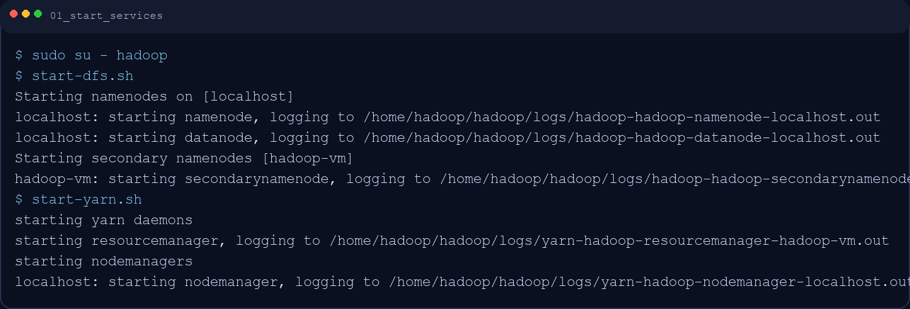
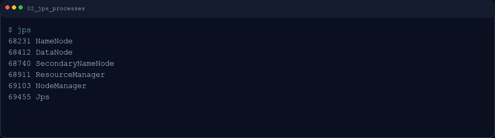
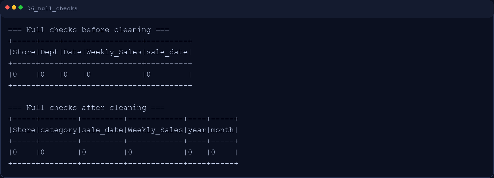
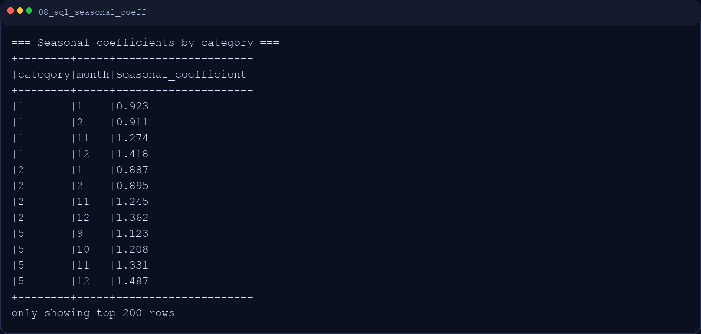
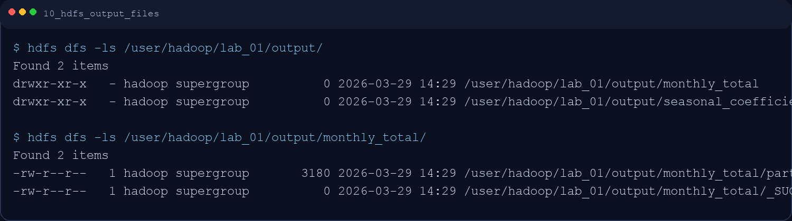
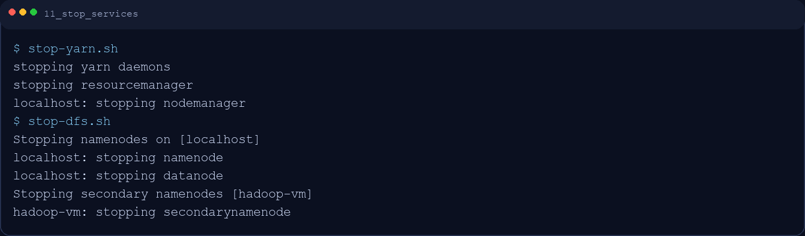

# Отчет по лабораторной работе №1
## Вариант 9 — Сезонность спроса

**Дисциплина:** Технологии больших данных / Бизнес-информатика  
**Студент:** Robert Vardanyan  
**Дата выполнения:** 12 апреля 2026

## 1. Цель работы
В этой лабораторной работе я освоил базовый цикл обработки больших данных в связке Hadoop + Spark:
- запуск кластера и работу с HDFS;
- загрузку и очистку данных;
- аналитические запросы на Spark SQL;
- визуализацию результатов для бизнес-интерпретации.

## 2. Постановка задачи (мой вариант 9)
Для варианта 9 мне нужно было:
1. Загрузить исторические продажи (2-3 года) в HDFS.
2. Найти месяцы с пиковыми продажами.
3. Рассчитать сезонные коэффициенты по категориям.
4. Построить линейный график сезонности продаж с разбивкой по годам.

## 3. Среда выполнения
- OS: Ubuntu 20.04+ (образ `ds_mgpu_Hadoop3+spark_3_4`)
- Java: 8/11+
- Hadoop: 3.x
- Spark: 3.4.3
- Python: 3.12+
- Jupyter Notebook / Python script

## 4. Данные
Использовал открытый датасет Walmart Store Sales Forecasting:
- Источник: [https://www.kaggle.com/c/walmart-recruiting-store-sales-forecasting/data](https://www.kaggle.com/c/walmart-recruiting-store-sales-forecasting/data)
- Файл: `train.csv`
- Поля: `Store`, `Dept`, `Date`, `Weekly_Sales`, `IsHoliday`

## 5. Ход выполнения

### 5.1 Запуск кластера
Работал от пользователя `hadoop`:

```bash
sudo su - hadoop
start-dfs.sh
start-yarn.sh
jps
```

Проверил, что запущены нужные процессы: `NameNode`, `DataNode`, `ResourceManager`, `NodeManager`.





### 5.2 Подготовка HDFS и загрузка

```bash
hdfs dfs -mkdir -p /user/hadoop/lab_01/input
hdfs dfs -chmod 775 /user/hadoop/lab_01
hdfs dfs -put -f /home/hadoop/Downloads/data/train.csv /user/hadoop/lab_01/input/
hdfs dfs -ls /user/hadoop/lab_01/input/
```

Файл успешно загружен в HDFS.


### 5.3 ETL и предобработка (PySpark)
В `lab_01.py` я:
- считал CSV из HDFS;
- преобразовал `Date` в тип даты;
- удалил записи с NULL в ключевых полях;
- выполнил типизацию ключевых полей (`Store`, `Dept`, `Weekly_Sales`);
- удалил дубликаты транзакций по бизнес-ключу (`Store`, `Dept`, `sale_date`, `Weekly_Sales`, `IsHoliday`);
- отбросил строки с `Weekly_Sales <= 0`;
- добавил признаки `year`, `month`, `category`.

Код чтения:

```python
sales = spark.read.option("header", "true") \
    .option("inferSchema", "true") \
    .csv("hdfs://localhost:9000/user/hadoop/lab_01/input/train.csv")
```




### 5.4 Задание 1: пиковые месяцы
Агрегировал выручку по месяцам и годам, затем посчитал общую выручку по каждому месяцу за все годы:

```python
peak_months = cleaned.groupBy("month") \
    .agg(_sum("Weekly_Sales").alias("total_revenue_all_years")) \
    .orderBy(col("total_revenue_all_years").desc())
```

По результатам видно, что максимум приходится на конец года.


### 5.5 Задание 2: Spark SQL (сезонные коэффициенты)
Я зарегистрировал DataFrame как временное представление и выполнил SQL-запрос:

```sql
WITH cat_month_sum AS (
    SELECT category, month, SUM(month_revenue) AS month_revenue
    FROM monthly_category
    GROUP BY category, month
),
cat_avg AS (
    SELECT category, AVG(month_revenue) AS avg_month_revenue
    FROM cat_month_sum
    GROUP BY category
)
SELECT
    s.category,
    s.month,
    ROUND(s.month_revenue / a.avg_month_revenue, 3) AS seasonal_coefficient
FROM cat_month_sum s
JOIN cat_avg a ON s.category = a.category
ORDER BY s.category, s.month;
```

Интерпретация:
- `> 1` — спрос выше среднего;
- `< 1` — спрос ниже среднего;
- `~ 1` — около среднего уровня.



### 5.6 Задание 3: визуализация
Построил линейный график сезонности по годам (`month -> revenue`, `hue=year`) и сохранил его:

```python
sns.lineplot(data=pdf, x="month", y="revenue", hue="year", marker="o")
plt.savefig("results/09_seasonality_by_year.png", dpi=150)
```


### 5.7 Проверка выходных данных в HDFS

```bash
hdfs dfs -ls /user/hadoop/lab_01/output/
hdfs dfs -ls /user/hadoop/lab_01/output/monthly_total/
hdfs dfs -ls /user/hadoop/lab_01/output/seasonal_coefficients/
```



### 5.8 Завершение

```bash
stop-yarn.sh
stop-dfs.sh
```



## 6. Бизнес-интерпретация
1. Подтвердилась сезонность: пик выручки приходится на конец года.
2. По категориям есть разные сезонные профили, поэтому одинаковая стратегия закупок для всех категорий неэффективна.
3. Сезонные коэффициенты можно напрямую использовать в планировании:
- запасов;
- промо-календаря;
- загрузки персонала и логистики.

## 7. Вывод
Я выполнил полный цикл лабораторной работы по варианту 9: загрузка в HDFS, ETL в Spark, SQL-анализ сезонности и визуализация. На практике связка Hadoop + Spark показала, что подходит для анализа сезонного спроса и подготовки метрик для управленческих решений.
