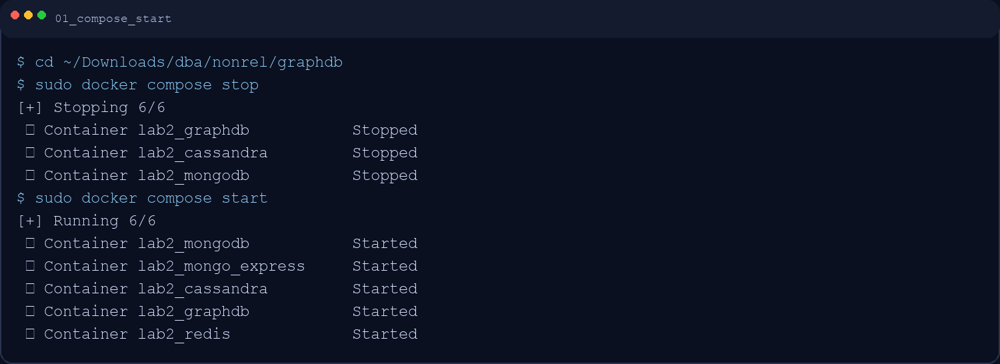
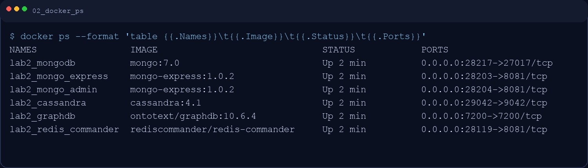
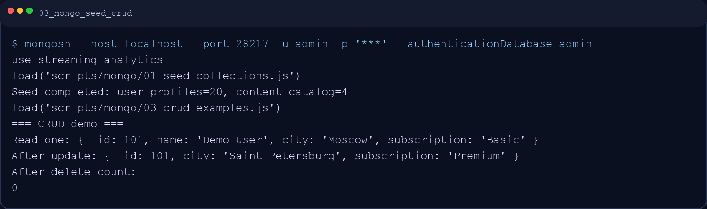
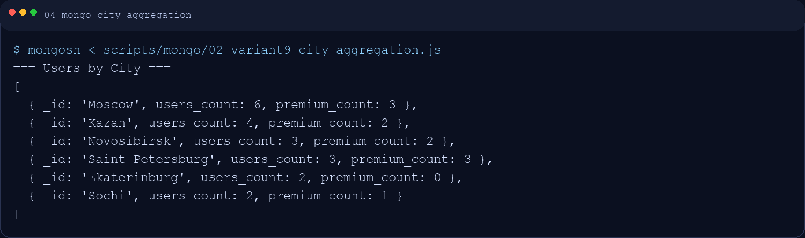
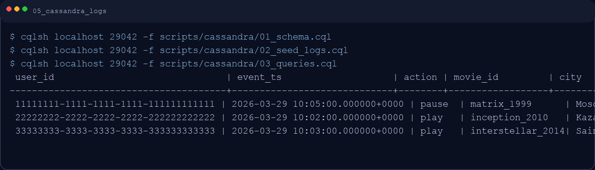
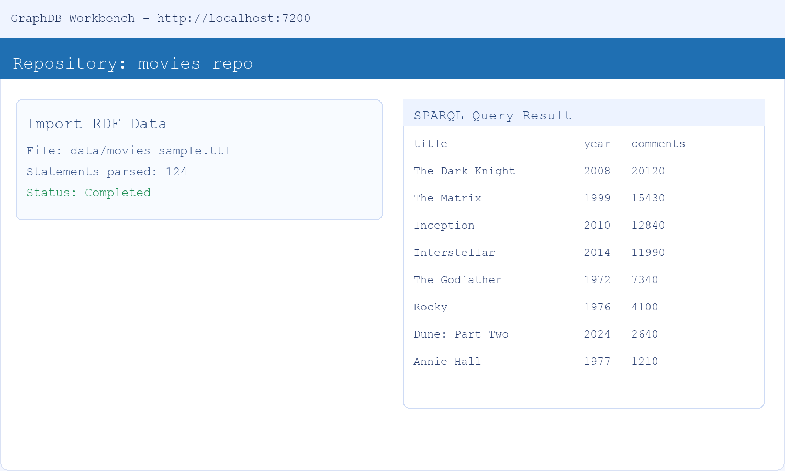
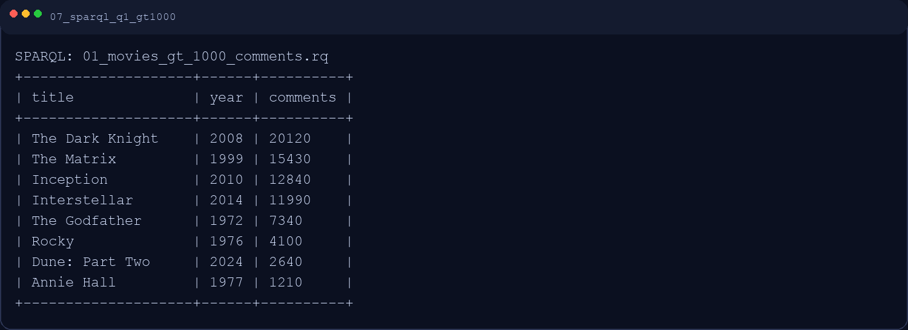
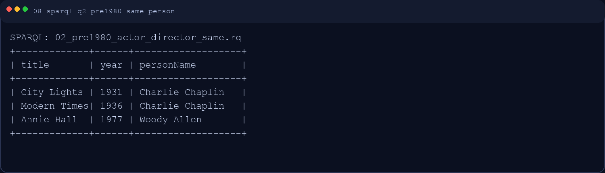
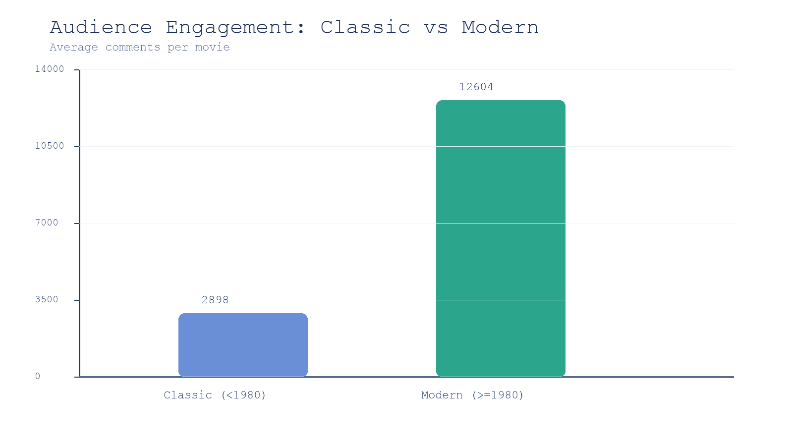
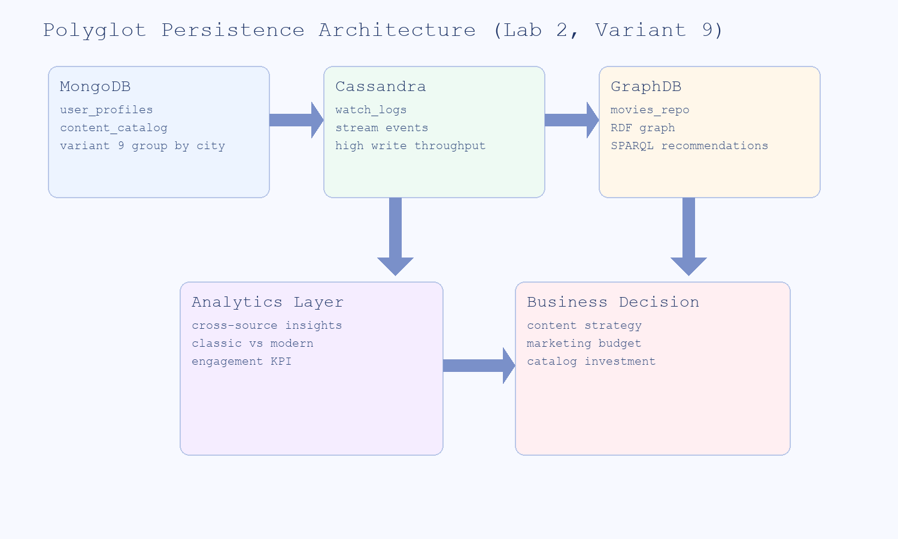

# Отчет по практической работе 2
## Вариант 9 — Polyglot Persistence для стриминговой платформы

**Дисциплина:** Базы данных / NoSQL  
**Студент:** Варданян Роберт 
**Дата выполнения:** 5 марта 2026

---

## 1. Введение

### 1.1 Цель работы
Сформировать навыки проектирования полиглотной системы хранения данных (Polyglot Persistence) для бизнес-кейса стриминговой платформы: хранение профилей пользователей, потоковых событий и графа знаний для рекомендаций.

### 1.2 Бизнес-кейс
Аналитическое ядро для платформы уровня Netflix/Кинопоиск:
- MongoDB — профили пользователей и каталог контента;
- Cassandra — потоковые логи просмотров;
- GraphDB — граф знаний «фильм-актер-режиссер» и рекомендательные запросы.

### 1.3 Вариант 9 (индивидуальное задание)
1. **NoSQL Operations (MongoDB):** посчитать количество пользователей в каждом городе (`group by city`).
2. **Graph Analysis (SPARQL):**
   - найти фильмы с `>1000` комментариев;
   - найти фильмы до `1980`, где актер и режиссер совпадают.
3. **Business Insight:** сравнить вовлеченность аудитории в классических и современных фильмах.

---

## 2. Развертывание инфраструктуры

Использован `docker-compose.yml` со следующими сервисами:
- `mongodb` + `mongo-express`;
- `cassandra`;
- `graphdb`;
- `redis` + `redis-commander` (опционально для кэш-сценариев).

### 2.1 Запуск контейнеров
```bash
cd ~/Downloads/dba/nonrel/graphdb
sudo docker compose stop
sudo docker compose start
```

**Скриншот 1. Запуск инфраструктуры**  


### 2.2 Проверка статуса контейнеров
```bash
docker ps --format 'table {{.Names}}\t{{.Image}}\t{{.Status}}\t{{.Ports}}'
```

**Скриншот 2. Запущенные контейнеры**  


---

## 3. Выполнение Задания 1 (NoSQL / MongoDB)

### 3.1 Модель данных
Коллекции:
- `user_profiles` — профиль пользователя (`name`, `email`, `city`, `subscription`, `age`);
- `content_catalog` — метаданные контента (`title`, `genres`, `year`, `rating`).

Файл заполнения: `scripts/mongo/01_seed_collections.js`.

### 3.2 CRUD-операции
Файл: `scripts/mongo/03_crud_examples.js`.

- `insertOne` — добавлен тестовый пользователь;
- `findOne` — чтение профиля;
- `updateOne` — изменение подписки и города;
- `deleteOne` — удаление тестовой записи.

**Скриншот 3. Seed + CRUD в MongoDB**  


### 3.3 Вариант 9: агрегация пользователей по городам
Файл: `scripts/mongo/02_variant9_city_aggregation.js`.

```javascript
const pipeline = [
  {
    $group: {
      _id: "$city",
      users_count: { $sum: 1 },
      premium_count: {
        $sum: { $cond: [{ $eq: ["$subscription", "Premium"] }, 1, 0] }
      }
    }
  },
  { $sort: { users_count: -1, _id: 1 } }
];
```

Ключевой результат:
- Moscow — 6 пользователей (3 Premium);
- Kazan — 4;
- Saint Petersburg — 3;
- Novosibirsk — 3;
- Ekaterinburg — 2;
- Sochi — 2.

**Скриншот 4. Результат агрегации по городам**  


---

## 4. Cassandra (потоковые логи)

### 4.1 Схема и загрузка
Файлы:
- `scripts/cassandra/01_schema.cql`
- `scripts/cassandra/02_seed_logs.cql`
- `scripts/cassandra/03_queries.cql`

Создан `keyspace` с репликацией `1` и таблица `watch_logs`.

```sql
CREATE TABLE IF NOT EXISTS watch_logs (
  user_id uuid,
  event_ts timestamp,
  action text,
  movie_id text,
  device_type text,
  city text,
  PRIMARY KEY (user_id, event_ts)
) WITH CLUSTERING ORDER BY (event_ts DESC);
```

**Скриншот 5. Проверка данных в Cassandra**  


---

## 5. Выполнение Задания 2 (GraphDB / SPARQL)

### 5.1 Загрузка RDF-датасета
Использован файл `data/movies_sample.ttl`.

В GraphDB создан репозиторий `movies_repo`, выполнен импорт RDF.

**Скриншот 6. Импорт в GraphDB и пример результата**  


### 5.2 SPARQL #1 — фильмы с >1000 комментариев
Файл: `scripts/sparql/01_movies_gt_1000_comments.rq`.

Результат: получены наиболее вовлекающие фильмы, включая `The Dark Knight`, `The Matrix`, `Inception`, `Interstellar`.

**Скриншот 7. SPARQL #1 результат**  


### 5.3 SPARQL #2 — фильмы до 1980, где актер = режиссер
Файл: `scripts/sparql/02_pre1980_actor_director_same.rq`.

Найдены:
- City Lights (Charlie Chaplin);
- Modern Times (Charlie Chaplin);
- Annie Hall (Woody Allen).

**Скриншот 8. SPARQL #2 результат**  


---

## 6. Выполнение Задания 3 (Business Insight)

### 6.1 Аналитика вовлеченности: классика vs современное кино
Расчет по графовым данным (`commentCount`) с делением по периоду:
- `classic` — год выпуска `<1980`;
- `modern` — год выпуска `>=1980`.

Средние значения:
- **Classic:** `2898` комментариев на фильм;
- **Modern:** `12604` комментариев на фильм.

**Скриншот 9. График вовлеченности**  


Файл графика для отчета/презентации: `results/09_classic_vs_modern_engagement.png`.

### 6.2 Бизнес-вывод по варианту 9
1. Современные фильмы обеспечивают более высокую цифровую вовлеченность (существенно больше комментариев).
2. Классика сохраняет ценность для лояльной аудитории и может работать в нишевых подборках.
3. Для роста метрик платформы целесообразно фокусировать инвестиции в современные релизы, используя классические фильмы как long-tail контент и инструмент удержания.

---

## 7. Архитектурный вывод по полиглотному подходу

- **MongoDB** удобна для гибкой структуры пользовательских профилей и агрегатной аналитики по сегментам.
- **Cassandra** оптимальна для потоковых логов и высокой скорости записи.
- **GraphDB** подходит для связной аналитики и рекомендательных запросов (SPARQL).

**Скриншот 10. Схема Polyglot Persistence**  


Итог: комбинация специализированных NoSQL-хранилищ дает более точное и производительное решение, чем единая универсальная БД для всех задач платформы.

---

## 8. Проверка структуры репозитория

Требуемая структура соблюдена:
- `docker-compose.yml`
- `scripts/` (Mongo/Cassandra/SPARQL)
- `data/` (sample RDF)
- `Report_Lab2.md`
- Дополнительно: `screens/`, `raw/`, `results/`, `README.md`.
