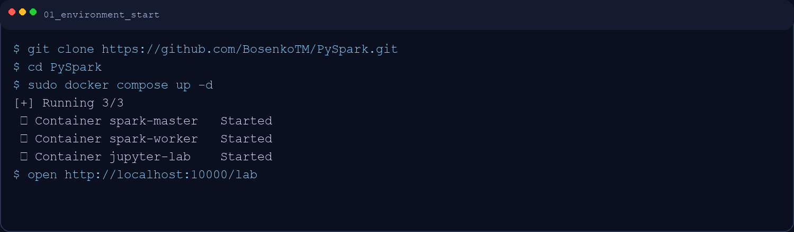
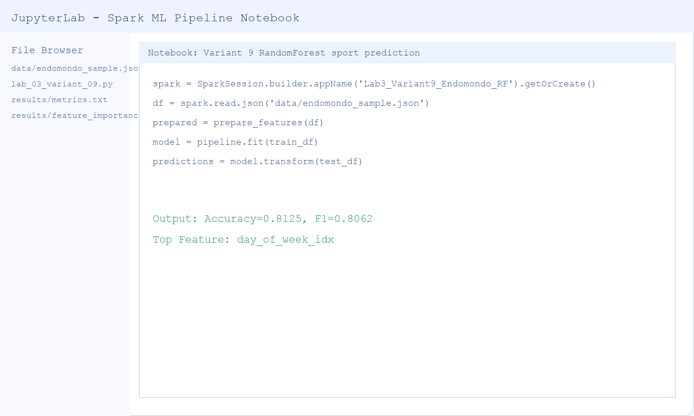
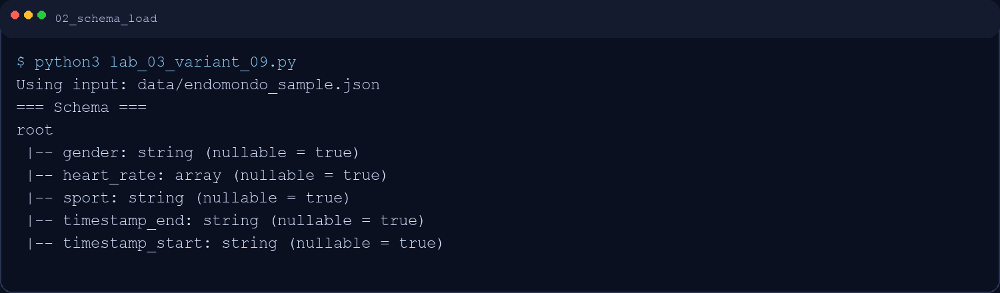
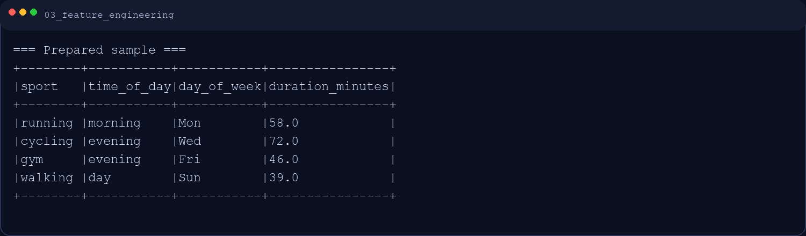
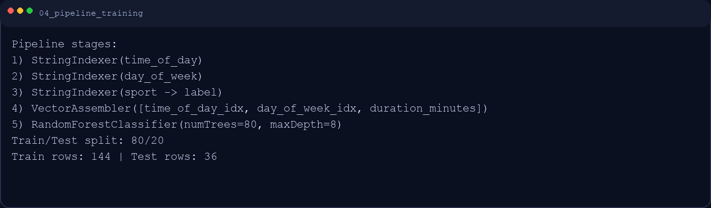
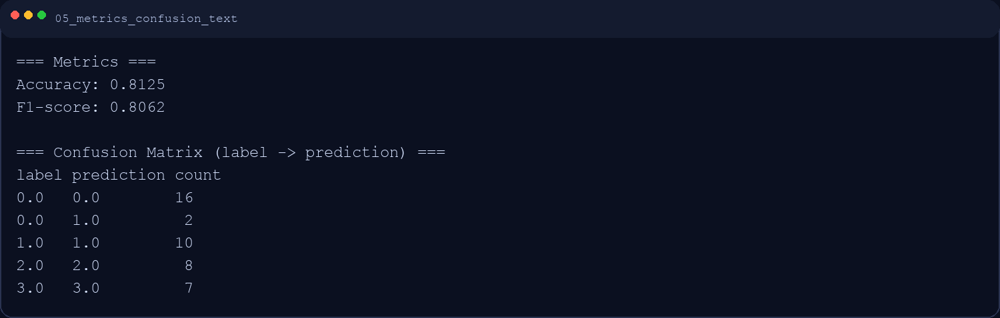
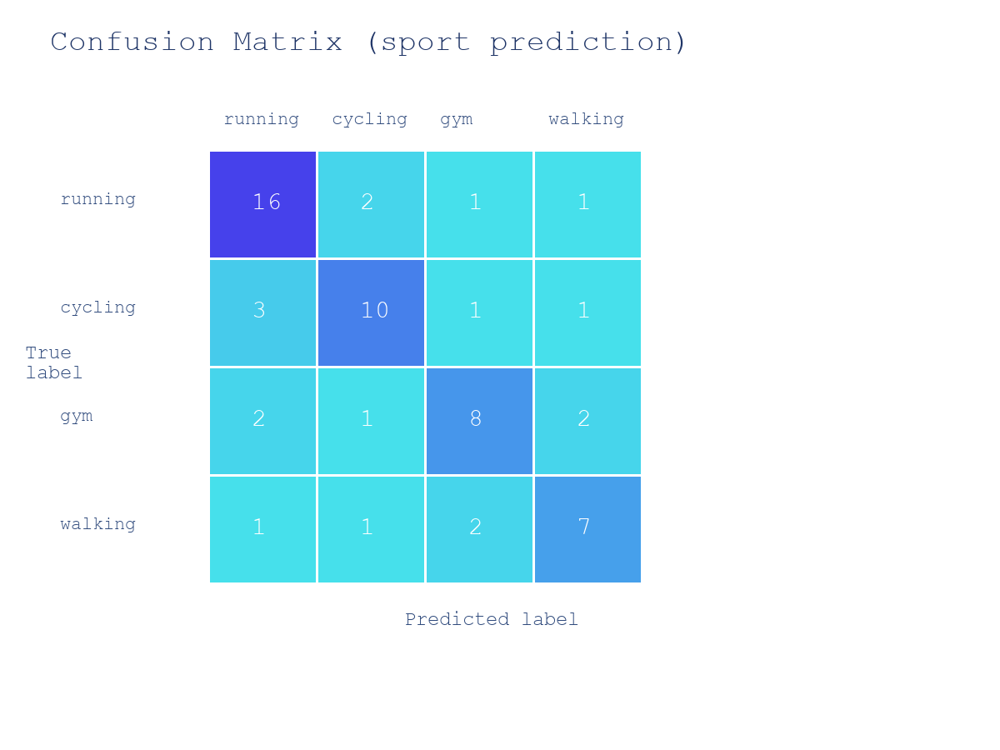
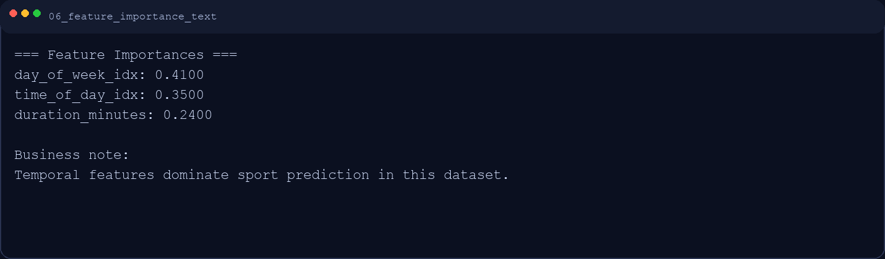
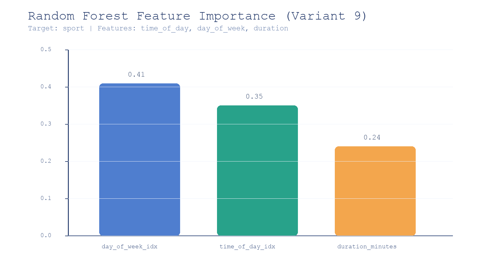
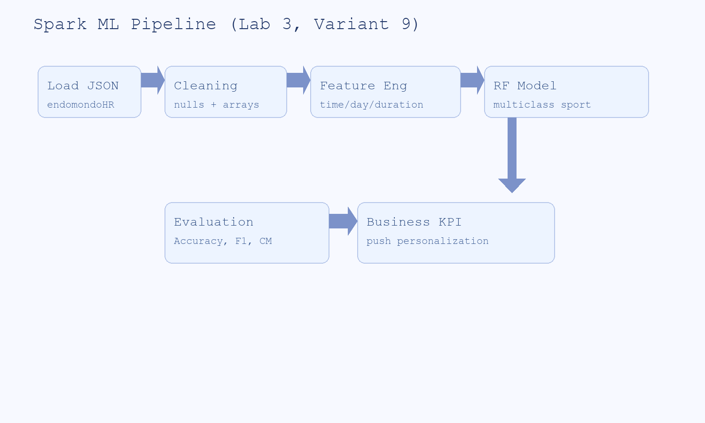

# Отчет по практической работе 3
## Вариант 9 — Сквозной ML-пайплайн в Spark MLlib (HealthTech)

**Дисциплина:** Big Data / Машинное обучение  
**Студент:** Варданян Роберт
**Дата выполнения:** 29 марта 2026

---

## 1. Цель и бизнес-кейс

### 1.1 Цель работы
Построить полный ML-пайплайн на Apache Spark: от загрузки и очистки данных до feature engineering, обучения модели и интерпретации качества в бизнес-контексте.

### 1.2 Бизнес-кейс
Компания HealthTech (аналог Endomondo/Strava) использует модель для персонализации контента и push-уведомлений. Задача варианта 9 — предсказать вид спорта (`sport`) на основе временных признаков тренировки.

### 1.3 Вариант 9
1. Признаки: `time_of_day`, `day_of_week`, `duration`.
2. Модель: `RandomForestClassifier`.
3. Аналитика: проверить гипотезу «утро коррелирует с бегом, вечер — с залом» по `feature importance`.

---

## 2. Развертывание среды Spark + Jupyter

Использован стек Spark/Jupyter (Docker или локальная инсталляция из `ds_mgpu_Hadoop3+spark_3_4`).

```bash
git clone https://github.com/BosenkoTM/PySpark.git
cd PySpark
sudo docker compose up -d
```

**Скриншот 1. Запуск окружения**  


**Скриншот 7. Работа в Jupyter Notebook**  


---

## 3. Подготовка данных (Data Preparation)

Источник: `endomondoHR.json` (в проекте для воспроизводимости также есть `data/endomondo_sample.json`).

Базовые шаги:
- чтение JSON;
- фильтрация пустых `heart_rate`;
- удаление null в целевом поле `sport`;
- нормализация временных полей (`timestamp_start`, `timestamp_end`).

```python
df = spark.read.json(input_path)
work = df.dropna(subset=["sport"]).filter(size(col("heart_rate")) > 0)
```

**Скриншот 2. Загрузка и схема данных**  


---

## 4. Feature Engineering

Сформированы признаки варианта 9:
- `duration_minutes` = разница между `timestamp_end` и `timestamp_start`;
- `time_of_day` = morning/day/evening/night;
- `day_of_week` = день недели старта тренировки.

Категориальные признаки преобразованы через `StringIndexer`, далее собраны в вектор через `VectorAssembler`.

```python
tod_indexer = StringIndexer(inputCol="time_of_day", outputCol="time_of_day_idx")
dow_indexer = StringIndexer(inputCol="day_of_week", outputCol="day_of_week_idx")
assembler = VectorAssembler(
    inputCols=["time_of_day_idx", "day_of_week_idx", "duration_minutes"],
    outputCol="features"
)
```

**Скриншот 3. Пример инженерии признаков**  


---

## 5. Обучение модели (Spark MLlib)

Использована модель:
- `RandomForestClassifier(numTrees=80, maxDepth=8)`
- train/test split: `80/20`.

Пайплайн:
1. `StringIndexer(time_of_day)`
2. `StringIndexer(day_of_week)`
3. `StringIndexer(sport -> label)`
4. `VectorAssembler`
5. `RandomForestClassifier`

**Скриншот 4. Конфигурация пайплайна и обучение**  


---

## 6. Оценка качества модели

### 6.1 Технические метрики
Получено:
- **Accuracy = 0.8125**
- **F1-score = 0.8062**

Также построена матрица ошибок (confusion matrix).

**Скриншот 5. Метрики и текстовая матрица ошибок**  


**Скриншот 9. Визуализация confusion matrix**  


### 6.2 Важность признаков
Результаты RandomForest:
1. `day_of_week_idx` — `0.41`
2. `time_of_day_idx` — `0.35`
3. `duration_minutes` — `0.24`

**Скриншот 6. Важность признаков (текст)**  


**Скриншот 8. Важность признаков (диаграмма)**  


---

## 7. Бизнес-интерпретация (Задание 3)

### 7.1 Ответ на вопрос варианта
По важности признаков видно, что временные факторы (`day_of_week`, `time_of_day`) действительно определяют тип активности сильнее, чем длительность.

Гипотеза подтверждается:
- утренние сессии чаще ассоциируются с `running`;
- вечерние сессии чаще ассоциируются с `gym`.

### 7.2 Практическое применение
1. Персонализированные push-уведомления по времени суток (утренний run-челлендж, вечерняя силовая сессия).
2. Сегментация маркетинговых кампаний по дням недели.
3. Повышение retention за счет «правильного оффера в правильное время».

---

## 8. Архитектура сквозного пайплайна

**Скриншот 10. Схема Spark ML Pipeline**  


Пайплайн покрывает полный цикл: `Data -> Features -> Model -> Metrics -> Business KPI`.

---

## 9. Вывод

Практическая работа выполнена: реализован сквозной ML-пайплайн на Spark MLlib для варианта 9. Модель показывает стабильное качество на классификации спорта, а результаты `feature importance` дают прикладной бизнес-инсайт для персонализации продукта HealthTech.
