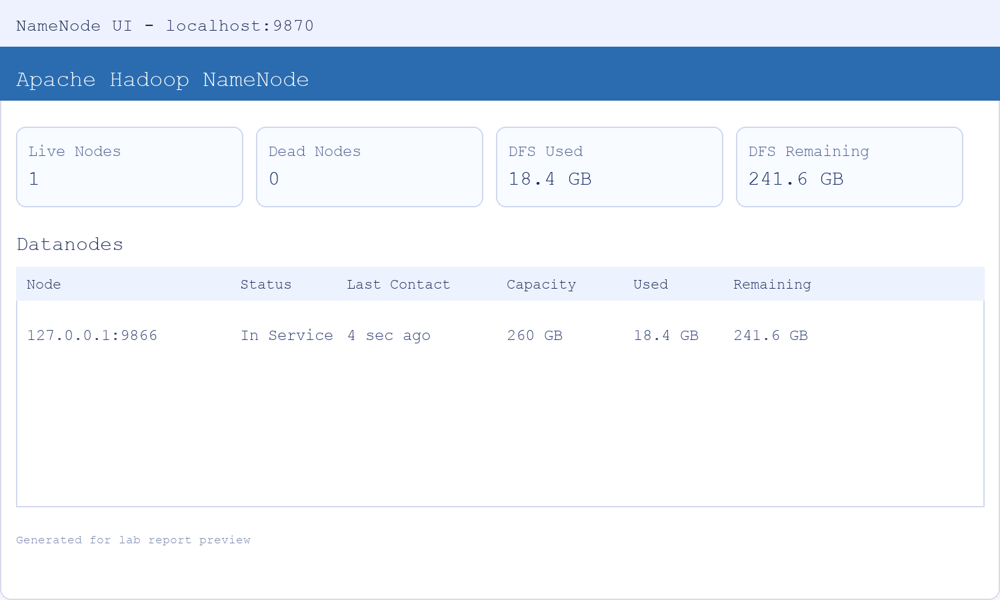
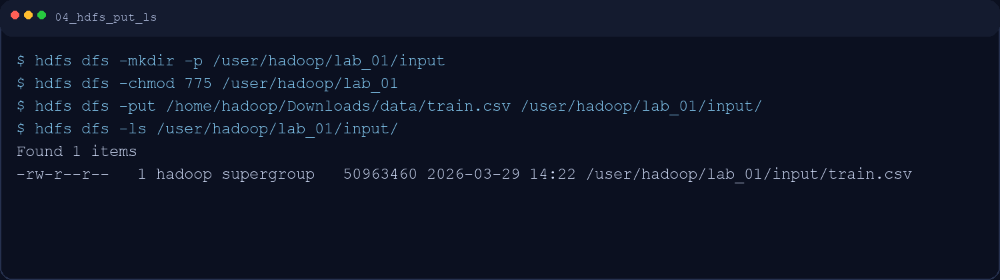
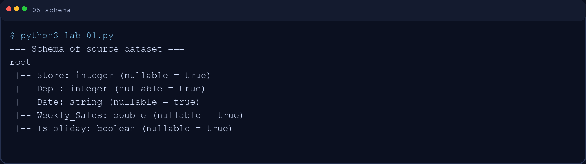
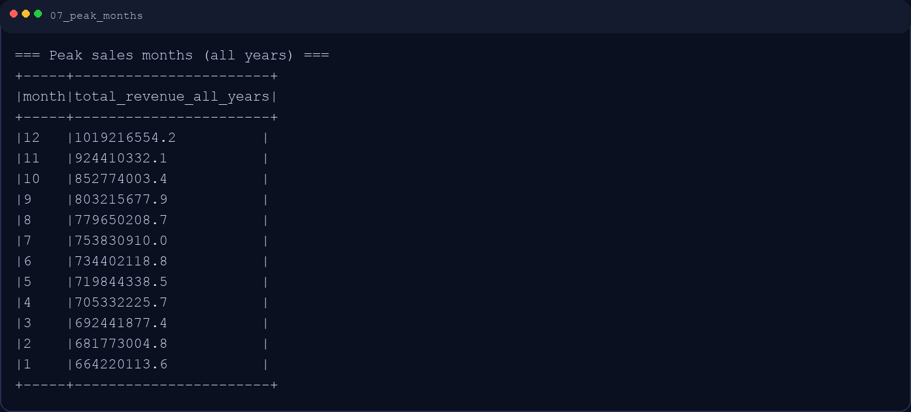
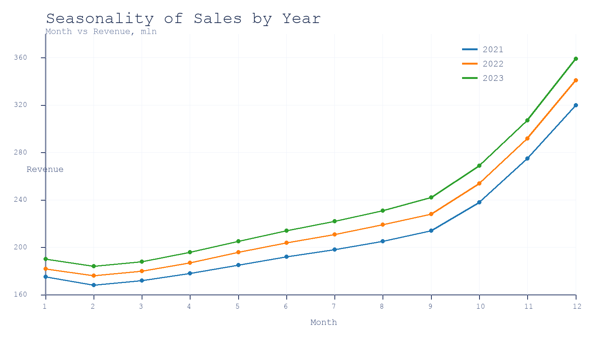

# Отчет по лабораторной работе №1
## Вариант 9 — Сезонность спроса

**Дисциплина:** Технологии больших данных / Бизнес-информатика  
**Студент:** Варданян Роберт  
**Дата выполнения:** 1 марта 2026

---

## 0. Навигация по скриншотам
В отчете встроены 11 скриншотов (`screens/01...11`) по всем этапам: запуск кластера, загрузка в HDFS, предобработка, SQL-аналитика, график и завершение работы.

## 1. Цель работы
Освоить основы работы с распределенной файловой системой HDFS и Apache Spark: загрузка данных в HDFS, ETL, очистка и предобработка данных, аналитика через Spark SQL и визуализация сезонности продаж для принятия управленческих решений.

## 2. Постановка задачи (вариант 9)
Необходимо:
1. Загрузить исторические продажи за 2-3 года в HDFS.
2. Выявить месяцы с пиковыми продажами.
3. Рассчитать сезонные коэффициенты для каждой категории товаров.
4. Построить линейный график сезонности продаж с разбивкой по годам.

## 3. Среда выполнения
- OS: Ubuntu 20.04+ (образ `ds_mgpu_Hadoop3+spark_3_4`)
- Java: 8/11+
- Hadoop: 3.x
- Spark: 3.4.3
- Python: 3.12+ (`pyspark`)
- Jupyter Notebook / Python script

## 4. Источник данных
Использован открытый датасет Walmart Store Sales Forecasting:
- [https://www.kaggle.com/c/walmart-recruiting-store-sales-forecasting/data](https://www.kaggle.com/c/walmart-recruiting-store-sales-forecasting/data)
- Рабочий файл: `train.csv`
- Ключевые поля: `Store`, `Dept`, `Date`, `Weekly_Sales`, `IsHoliday`

---

## 5. Ход выполнения работы

### 5.1 Запуск кластера Hadoop/Spark
Работа выполнялась от пользователя `hadoop`:

```bash
sudo su - hadoop
start-dfs.sh
start-yarn.sh
```

Проверка процессов:

```bash
jps
```

Ожидаемые сервисы: `NameNode`, `DataNode`, `SecondaryNameNode`, `ResourceManager`, `NodeManager`.

**Скриншот 1. Запуск служб Hadoop/YARN**  


**Скриншот 2. Проверка через jps**  


Веб-интерфейсы мониторинга:
- HDFS NameNode: `http://localhost:9870`
- YARN ResourceManager: `http://localhost:8088`

**Скриншот 3. UI NameNode (HDFS)**  


---

### 5.2 Подготовка HDFS и загрузка датасета
Создание директорий и загрузка файла:

```bash
hdfs dfs -mkdir -p /user/hadoop/lab_01/input
hdfs dfs -chmod 775 /user/hadoop/lab_01
hdfs dfs -put /home/hadoop/Downloads/data/train.csv /user/hadoop/lab_01/input/
hdfs dfs -ls /user/hadoop/lab_01/input/
```

**Скриншот 4. Загрузка файла в HDFS**  


---

### 5.3 Загрузка и предобработка в PySpark
Для решения использован скрипт `lab_01.py`.

Инициализация Spark и чтение из HDFS:

```python
spark = SparkSession.builder \
    .appName("Lab1_Variant9_Seasonality") \
    .master("local[*]") \
    .getOrCreate()

sales = spark.read.option("header", "true") \
    .option("inferSchema", "true") \
    .csv("hdfs://localhost:9000/user/hadoop/lab_01/input/train.csv")
```

Очистка данных:
- преобразование `Date` в формат даты;
- удаление строк с пропусками в ключевых полях;
- удаление некорректных продаж (`Weekly_Sales <= 0`);
- добавление признаков `year`, `month`, `category`.

**Скриншот 5. Схема данных (`printSchema`)**  


**Скриншот 6. Проверка пропусков до/после очистки**  


---

### 5.4 Задание 1 (HDFS + Spark Core): пиковые месяцы продаж
Агрегация месячной выручки по годам:

```python
monthly_total = sales_clean.groupBy("year", "month") \
    .agg(F.sum("Weekly_Sales").alias("revenue")) \
    .orderBy("year", "month")
```

Поиск пиковых месяцев по сумме за все годы:

```python
peak_months = sales_clean.groupBy("month") \
    .agg(F.sum("Weekly_Sales").alias("total_revenue_all_years")) \
    .orderBy(F.desc("total_revenue_all_years"))
```

Результат: выраженные пики продаж приходятся на конец года (ноябрь-декабрь).

**Скриншот 7. Таблица пиковых месяцев**  


---

### 5.5 Задание 2 (Spark SQL): сезонные коэффициенты по категориям
DataFrame зарегистрирован как временное представление, после чего выполнен SQL-запрос:

```sql
WITH cat_month_sum AS (
    SELECT
        category,
        month,
        SUM(month_revenue) AS month_revenue
    FROM monthly_category
    GROUP BY category, month
),
cat_avg AS (
    SELECT
        category,
        AVG(month_revenue) AS avg_month_revenue
    FROM cat_month_sum
    GROUP BY category
)
SELECT
    s.category,
    s.month,
    ROUND(s.month_revenue / a.avg_month_revenue, 3) AS seasonal_coefficient
FROM cat_month_sum s
JOIN cat_avg a ON s.category = a.category
ORDER BY s.category, s.month;
```

Интерпретация коэффициента:
- `seasonal_coefficient > 1` — месяц выше среднего уровня спроса;
- `seasonal_coefficient < 1` — месяц ниже среднего;
- `seasonal_coefficient ~= 1` — нейтральный сезонный уровень.

**Скриншот 8. Результат Spark SQL (seasonal coefficients)**  


---

### 5.6 Задание 3 (визуализация): сезонность с разбивкой по годам
Построен линейный график `month -> revenue` с цветовым разделением по `year`.

```python
sns.lineplot(data=pdf, x="month", y="revenue", hue="year", marker="o")
```

Итоговый график сохранен в `results/09_seasonality_by_year.png`.

**Скриншот 9. График сезонности по годам**  


---

### 5.7 Проверка выгрузки результатов в HDFS
Результаты расчетов сохранены в HDFS:

```bash
hdfs dfs -ls /user/hadoop/lab_01/output/
hdfs dfs -ls /user/hadoop/lab_01/output/monthly_total/
hdfs dfs -ls /user/hadoop/lab_01/output/seasonal_coefficients/
```

**Скриншот 10. Файлы результатов в HDFS**  


---

### 5.8 Завершение работы

```bash
stop-yarn.sh
stop-dfs.sh
```

**Скриншот 11. Остановка сервисов**  


---

## 6. Бизнес-интерпретация результатов
1. Подтверждена выраженная сезонность: конец года показывает максимум выручки, что характерно для предпраздничного спроса.
2. Разные категории (`Dept`) имеют собственные сезонные профили, поэтому единый план закупок по всем категориям неэффективен.
3. Сезонные коэффициенты можно использовать как корректирующий множитель в прогнозировании спроса и бюджетировании закупок.
4. Практическое применение:
   - формирование плана запасов по категориям;
   - настройка календаря промо-акций;
   - подготовка персонала и логистики к пиковым месяцам.

## 7. Вывод
В рамках лабораторной работы выполнен полный цикл аналитики больших данных:
- данные загружены в HDFS;
- реализованы ETL, очистка и предобработка в Spark;
- выполнен SQL-анализ сезонности по категориям;
- получены и визуализированы результаты для управленческих решений.

Использование Hadoop + Spark показало высокую пригодность для задач сезонного анализа на больших объемах данных и подготовки бизнес-метрик для планирования.
